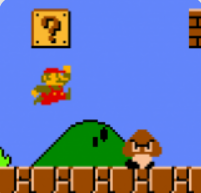

# Super Mario Automated Project

Welcome to  Super Mario Automated Project

## Table of Contents

- [Introduction](#introduction)
- [Installation](#installation)
- [Usage](#usage)
- [Contribution](#contribution)
- [License](#license)

## Introduction

The Super Mario Automated Project enables users to control Super Mario using natural body gestures with enhanced interaction mechanics. 



## Installation

1. Clone the repository:
   ```bash
   git clone https://github.com/Rohit131313/Super-Mario-Automated.git

2. Install the Required Dependencies
To set up the Super Mario Automated Project, follow these steps:

##### Step 1: Install Python Packages
Open your command prompt or terminal and navigate to your project directory. Run the following commands to install the necessary Python packages:
```bash
    pip install -r requirements.txt
```
##### Step 2: Use an Emulator
You can either use an online emulator or set up your own local emulator to play Super Mario.
For the online emulator , you can visit this [link](https://www.playroms.net/nes-roms/super-mario-bros/)

## Usage
1. Run the Program
Execute the Control.py file
```python
   python Control.py
```
2. Control Game Actions
Interact with the game using natural body movements. Upon starting the program, vertical and horizontal lines will be drawn on the screen via the webcam to facilitate gesture recognition.

- Movement Control:

    - Vertical Line Interaction: 
        - Move to the left or right of the vertical line drawn on the screen to control the character's left or right movement. Shifting your body to the left moves the character left, and shifting to the right moves the character right.


- Action Control:

    - Horizontal Line Interaction:
        - Small Jump: Raise your shoulders above the first horizontal line to trigger a small jump in the game.
        - Long Jump: Raise your shoulders above the second horizontal line to perform a long jump.
        - Move Down: Lower your head below the first horizontal line to cause the character to duck or move down.

## Contribution
Contributions are welcome! If you have any ideas for improvements, found a bug, or want to add new features, feel free to open an issue or submit a pull request. 

We appreciate your contributions to make Gesture Volume Project even better!

## License
`MIT License`