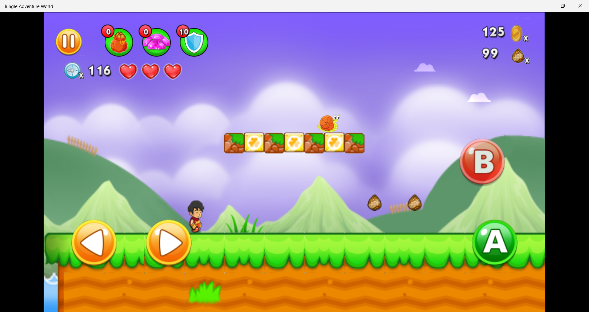

# Jungle Adventure World Automated Project

Welcome to  Jungle Adventure World Automated Project

## Table of Contents

- [Introduction](#introduction)
- [Installation](#installation)
- [Usage](#usage)
- [Contribution](#contribution)
- [License](#license)

## Introduction

The Jungle Adventure World Automated Project enables users to control Jungle Adventure World using natural body gestures. Moving left and right mimics real-life motions, while raising the right hand above the right shoulder triggers the character to jump. Similarly, raising the left hand allows the player to throw stones. This project utilizes MediaPipe and PyDirectInput to accurately interpret these gestures, enhancing gameplay by integrating physical movements with digital interactions.




## Installation

1. Clone the repository:
   ```bash
   git clone https://github.com/Rohit131313/Jungle-Adventure-World-Automated.git

2. Install the Required Dependencies
To set up the Jungle Adventure World Automated Project, follow these steps:

##### Step 1: Install Python Packages
Open your command prompt or terminal and navigate to your project directory. Run the following commands to install the necessary Python packages:
```bash
    pip install -r requirements.txt
```
##### Step 2: Install the Game
1. Search and Install from Microsoft Store:

Search for Jungle Adventure World on the Microsoft Store or click link https://www.microsoft.com/store/productId/9N713BXB0R5H?ocid=pdpshare to navigate directly to the game's page.

2. Download and Install:

Follow the instructions on the Microsoft Store page to download and install the game.


## Usage
1. Run the Program
Execute the Control.py file
```python
   python Control.py
```
2. Control Game Actions

Interact with the game using shoulder or body movements:

- Movement Control:

    - Shift your shoulders or whole body to the right to simulate right movement in the game.
    - Shift your shoulders or whole body to the left to simulate left movement in the game.

- Action Control:

    - Raise your right hand above your right shoulder to trigger actions like jumping or moving upwards in the game.
    - Raise your left hand to perform actions such as throwing stones or executing specific game functions.

## Contribution
Contributions are welcome! If you have any ideas for improvements, found a bug, or want to add new features, feel free to open an issue or submit a pull request. 

We appreciate your contributions to make Gesture Volume Project even better!

## License
`MIT License`